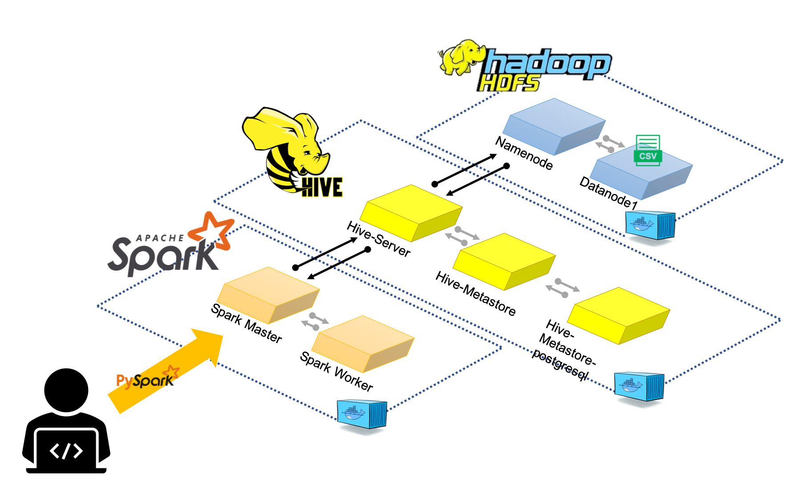
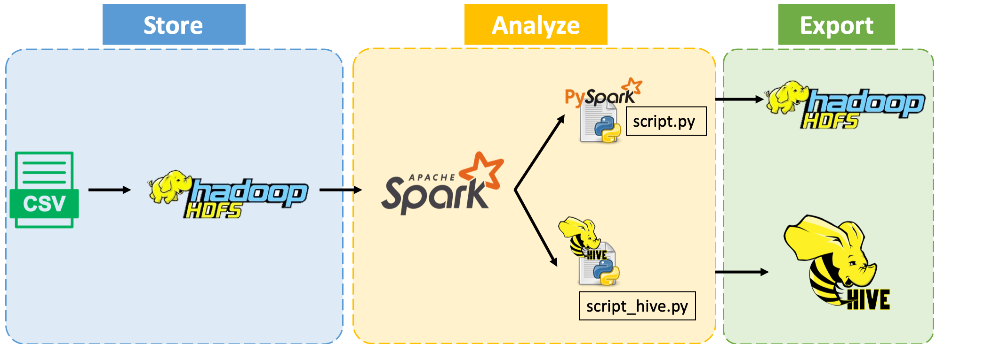

<!-- # docker-compose with hdfs (namenode+datanode), hive2, spark2, jupyter notebook with pyspark

Versions:  
- Hadoop 2.7
- Hive 2.3.2 (metastore on postgres)
- Spark 2.4.5 (works with python3 and OpenJDK 8)
- Jupyter Notebook with pyspark (spark 2.4.5)

For start:  
1) In terminal `cd /path/to/project/`
2) (optional) Change shared folders for jupyter and/or spark-master services in volumes key
3) Enter `docker-compose up` and wait while services starting
4) Enter `docker exec jupyter jupyter notebook list` for get notebook url
5) (optional) Move example.ipynb file to jupyter shared folder and open its in notebook (url from step above)

Some details:  
- For start job on cluster, use `.master('spark://spark-master:7077')` when create SparkSession
- For access to Hive through spark.sql (saveAsTable, sql etc) add `.enableHiveSupport()` when create SparkSession
- Default spark file system - HDFS (hint: `docker exec namenode hdfs dfs -ls /user/jovyan/` for check files that saved from notebook)
- Python on jupyter container use conda -->
## Requirement
* Install Docker Desktop. You can download here: https://docs.docker.com/get-docker/

* Check whether `docker-compose` is available:
    ```
    $ docker-compose --version
    ```


# Construct the big-data analytic environment
The following figure is our framework:


1. git clone this project

2. cd into this directory, and `docker-compose` the containers
    (Note: it might take a while to construct)
    ```
    $ docker-compose up -d
    ```
    

3. Check all the containers
    ```
    $ docker ps
    ```

    ```
    Service <-> Container Name
    HDFS <-> namenode
    Hive <-> hive-server
    PySpark, Spark <-> spark-master
    ```

## Upload file on HDFS
HDFS is in the container: `namenode`
* Copy file into container
    ```
    $ docker cp dataset.csv namenode:/
    ```

* Access into container
    ```
    $ docker exec -it namenode bash
    ```

* Make directory and upload the .csv on our HDFS
    ```
    $ hdfs dfs -mkdir -p /usr/spotify
    $ hdfs dfs -put dataset.csv /usr/spotify
    ```

* Check whether the file is on HDFS
    ```
    $ hdfs dfs -ls /usr/spotify
    ```
    output should be the following
    ```
    Found 1 items
    -rw-r--r--   3 root supergroup   19318740 2023-11-29 01:25 /usr/spotify/dataset.csv
    ```

## Read Hadoop data from spark
Spark and PySpark are in the container: `spark-master`
* Access into PySpark container
    ```
    $ docker exec -it spark-master bash
    ```

* Start PySpark environment
    ```
    $ /spark/bin/pyspark
    ```
    After that, the stdout should be this:
    ```
    Welcome to
        ____              __
        / __/__  ___ _____/ /__
        _\ \/ _ \/ _ `/ __/  '_/
    /__ / .__/\_,_/_/ /_/\_\   version 2.4.5
        /_/

    Using Python version 3.7.5 (default, Oct 17 2019 12:25:15)
    SparkSession available as 'spark'.
    >>>
    ```

* Read the dataset.csv on HDFS
    ```
    df = spark.read.csv("hdfs:///usr/spotify/dataset.csv", header=True, escape='"')
    df.show(5)
    ```

* It should show the following
    ```
    >>> df = spark.read.csv("hdfs:///usr/spotify/dataset.csv", header=True, escape='"')
    >>> df.show(5)
    +--------------------+--------------------+--------------------+--------------------+----------+-----------+--------+------------+------+---+--------+----+-----------+------------+----------------+--------+-------+-------+--------------+-----------+
    |            track_id|             artists|          album_name|          track_name|popularity|duration_ms|explicit|danceability|energy|key|loudness|mode|speechiness|acousticness|instrumentalness|liveness|valence|  tempo|time_signature|track_genre|
    +--------------------+--------------------+--------------------+--------------------+----------+-----------+--------+------------+------+---+--------+----+-----------+------------+----------------+--------+-------+-------+--------------+-----------+
    |5SuOikwiRyPMVoIQD...|         Gen Hoshino|              Comedy|              Comedy|        73|     230666|   FALSE|       0.676| 0.461|  1|  -6.746|   0|      0.143|      0.0322|        1.01E-06|   0.358|  0.715| 87.917|             4|   acoustic|
    |4qPNDBW1i3p13qLCt...|        Ben Woodward|    Ghost (Acoustic)|    Ghost - Acoustic|        55|     149610|   FALSE|        0.42| 0.166|  1| -17.235|   1|     0.0763|       0.924|        5.56E-06|   0.101|  0.267| 77.489|             4|   acoustic|
    |1iJBSr7s7jYXzM8EG...|Ingrid Michaelson...|      To Begin Again|      To Begin Again|        57|     210826|   FALSE|       0.438| 0.359|  0|  -9.734|   1|     0.0557|        0.21|               0|   0.117|   0.12| 76.332|             4|   acoustic|
    |6lfxq3CG4xtTiEg7o...|        Kina Grannis|Crazy Rich Asians...|Can't Help Fallin...|        71|     201933|   FALSE|       0.266|0.0596|  0| -18.515|   1|     0.0363|       0.905|        7.07E-05|   0.132|  0.143| 181.74|             3|   acoustic|
    |5vjLSffimiIP26QG5...|    Chord Overstreet|             Hold On|             Hold On|        82|     198853|   FALSE|       0.618| 0.443|  2|  -9.681|   1|     0.0526|       0.469|               0|  0.0829|  0.167|119.949|             4|   acoustic|
    +--------------------+--------------------+--------------------+--------------------+----------+-----------+--------+------------+------+---+--------+----+-----------+------------+----------------+--------+-------+-------+--------------+-----------+
    only showing top 5 rows
    ```

* Upload the spark dataframe to Hive
    ```
    df.write.mode('overwrite').saveAsTable("dataset")
    ```

## Check the stored data on Hive
Hive sever is on container: `hive-server`
* Access into hive contanier
    ```
    $ docker exec -it hive-server bash
    ```

* Check whether the table `dataset` is on hive
    ```
    $ hive
    $ hive> show tables;
    ```
    the result should be
    ```
    hive> show tables;
    OK
    dataset
    Time taken: 0.308 seconds, Fetched: 1 row(s)
    ```

* Select some data to confirm
    ```
    SELECT * FROM dataset LIMIT 5;
    ```
    The result should be
    ```
    OK
    SLF4J: Failed to load class "org.slf4j.impl.StaticLoggerBinder".
    SLF4J: Defaulting to no-operation (NOP) logger implementation
    SLF4J: See http://www.slf4j.org/codes.html#StaticLoggerBinder for further details.
    5SuOikwiRyPMVoIQDJUgSV	Gen Hoshino	Comedy	Comedy	73	230666	FALSE	0.676	0.461	1	-6.746	0	0.143	0.0322	1.01E-06	0.358	0.715	87.917	4	acoustic
    4qPNDBW1i3p13qLCt0Ki3A	Ben Woodward	Ghost (Acoustic)	Ghost - Acoustic	55	149610	FALSE	0.42	0.166	1-17.235	1	0.0763	0.924	5.56E-06	0.101	0.267	77.489	4	acoustic
    1iJBSr7s7jYXzM8EGcbK5b	Ingrid Michaelson;ZAYN	To Begin Again	To Begin Again	57	210826	FALSE	0.438	0.359	0	-9.734	1	0.0557	0.21	0	0.117	0.12	76.332	4	acoustic
    6lfxq3CG4xtTiEg7opyCyx	Kina Grannis	Crazy Rich Asians (Original Motion Picture Soundtrack)	Can't Help Falling In Love	71	201933	FALSE	0.266	0.0596	0	-18.515	1	0.0363	0.905	7.07E-05	0.132	0.143	181.74	3	acoustic
    5vjLSffimiIP26QG5WcN2K	Chord Overstreet	Hold On	Hold On	82	198853	FALSE	0.618	0.443	2	-9.681	1	0.0526	0.469	0	0.0829	0.167	119.949	4	acoustic
    Time taken: 6.944 seconds, Fetched: 5 row(s)
    ```

Up till now, the data is all set. We are ready to analyze it.

# Analyze music data on Big-Data environment
Please reference the two scripts: [script.py](https://github.com/pcchencode/dockerized-big-data-system/blob/master/script.py) and [script_hive.py](https://github.com/pcchencode/dockerized-big-data-system/blob/master/script_hive.py). The following demostrates the overall data pipeline:


## [Important!] please use the environment in `jupyter` container
1. Copy [script.py](https://github.com/pcchencode/dockerized-big-data-system/blob/master/script.py) and [script_hive.py](https://github.com/pcchencode/dockerized-big-data-system/blob/master/script_hive.py) into container.
    ```
    $ docker cp script.py jupyter:/home/jovyan/work/
    $ docker cp script_hive.py jupyter:/home/jovyan/work/
    ```

2. Access into `jupyter` container to check whether is in it:
    ```
    $ docker exec -it jupyter bash
    $ jovyan@9b1584d48ad2:~/work$ ls
    ```
    The result should be
    ```
    script_hive.py  script.py
    jovyan@9b1584d48ad2:~/work$
    ```
Then there you go can run the script:
## Analyze the data via PySpark
#### How to run the script?
1. First, go into `jupyter` container
    ```
    $ docker exec -it jupyter bash
    ```
2. run this command
    ```
    python3 script.py
    ```
Check the `script.py`
The basic data pipeline
1. Load Data
2. Summary Statistics
3. Export

## Analyze the data via Hive
#### How to run the script?
1. First, go into `jupyter` container
    ```
    $ docker exec -it jupyter bash
    ```
2. run this command
    ```
    python3 script_hive.py
    ```
Check the `script_hive.py`
1. Load Data
2. Summary Statistics
3. Export